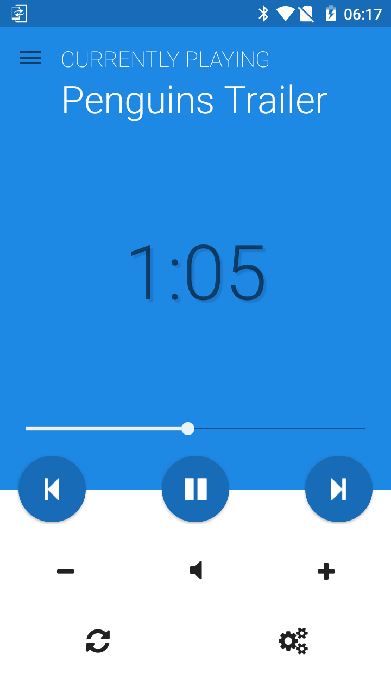
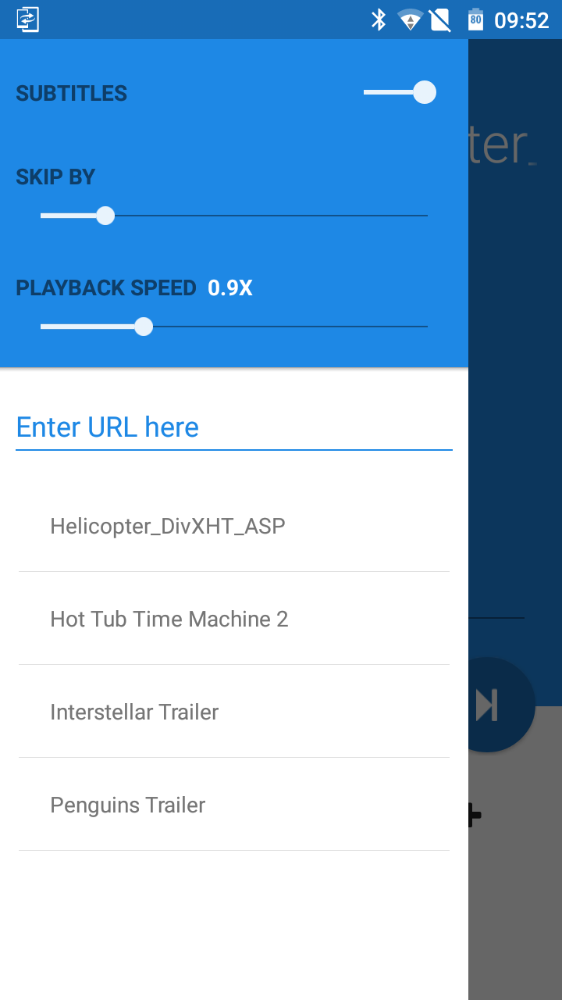
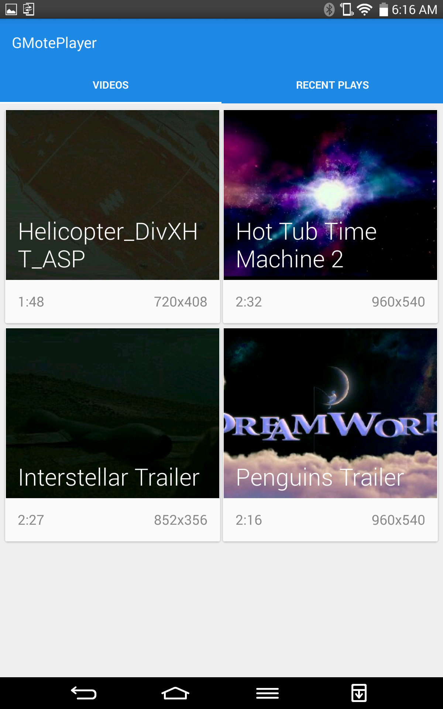
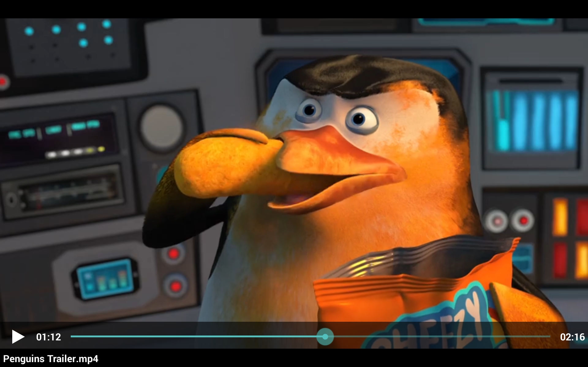

# GMote

This is one of the winning applications of the LG QPair Contest held at XDA-Developers. It used the QPair API provided by LG
<a href="http://www.xda-developers.com/lg-development-challenge-winners/">
  
You can read about the contest here.

</a>

<a href="http://forum.xda-developers.com/lg-g-pad-83/orig-development/project-gmote-t2924232">
  
XDA Development Thread

</a>

What's **GMote** you ask? To put it simply, it's way to use any Android smartphone as a media remote for your LG GPad (Android to Android). Meaning you can sit back, relax, connect your GPad to your TV and control media playback from the comfort of your couch.

GMote is not a standalone application, there's actually 2 of them (confusing I know). Anyway, ones for your phone and the other is the companion app for your GPad. A video player for the tablet which will support a wide range of formats. Going on, a remote for the phone with which you could Play, Pause, Volume Control, Scrubbing.

Also, this isn't just a onetime gimmick, it's something that comes in handy when you have a movie on your GPad and you want to watch it on a big screen with your friends and you don't want to turn on your laptop just to transfer it to a USB. I tried to be punny. So if you're a media lover, someone who love to watch movies (emoticon) and tv shows, this project might just be for you.

#### Features
- Media Playback
- Play videos from URLs (Enter on tab or send through phone)
- Playback Control (Play, Pause, Scrub)
- Volume Control (Hardware keys on phone included)
- Multiple format support (DivX/Xvid, WMV, FLV, TS/TP, RMVB, MKV, MOV, M4V, AVI , MP4, 3GP)

            

## The Nitty Gritty
GMote depends on some libraries. Each of which, along with it's function in this project and links for download are defined below:

#### LG QPair
This is essential for the project to function, as it handles the bluetooth connection and data transfer between the 2 devices. Download the latest LG QPair SDK revision and add the jar to libs/
<a href="http://developer.lge.com/resource/mobile/RetrieveSDKInfo.dev">
  
You can find it here.

</a>

#### Material Design Library
As the name implies, this library is used to backport some of the new Material Design from Android Lollipop to older versions. 
Specifically, we're using the Flat Button, Switch and Slider. Add project as a library to GMote.
<a href="https://github.com/navasmdc/MaterialDesignLibrary">
  
You can find it here.

</a>

#### Android Support Library v7
To add to the Material Design scheme of things, this project also uses AppCompat in the support-v7 library of the Android SDK. Remember to add it.

#### Iconify
This is more optional than necessary. This library adds the ability to use icons from FontAwesome, which retain quality no matter what the screen resolution, saving you from the hassle of making new icons for each dpi (hdpi, xhpdi etc). You will need to add the FontAwesome ttf to the assets folder, also add the jar to libs/
<a href="https://github.com/JoanZapata/android-iconify">
  
You can find it here.

</a>

#### ButterKnife
Used for View Injection. Basically saving you from the hassle of finding views by ID each time. Add jar to libs/
<a href="http://jakewharton.github.io/butterknife/index.html">
  
You can find it here.

</a>

#### Priority Job Queue
Now this is important. Every action performed on GMote (play, pause, skip etc) are added to a queue and the requests are sent one by one, making sure all actions are acted upon and none are lost in the process when doing multiple actions. Add jar to libs/
<a href="https://github.com/path/android-priority-jobqueue">
  
You can find it here.

</a>
